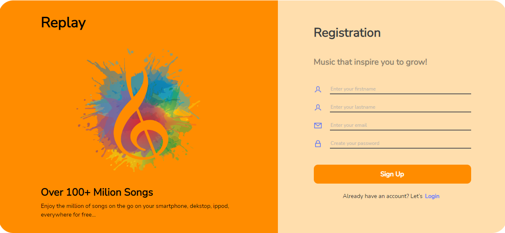
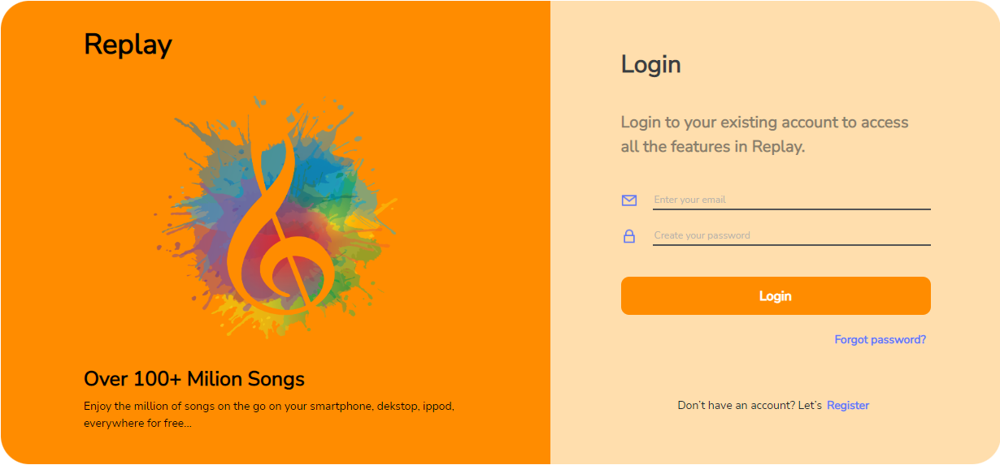

    

<h1 align='center'>Music App</h1>

## About The Project

 

 <strong>Music App</strong> is a website that provides music player on dekstop. It has features such as users can read, update, create and delete the music playlist.
 

## Built With

    other packages see file `package.json`

The page will reload when you make changes.\
You may also see any lint errors in the console.!

## Requirements

1. <a href="https://nodejs.org/en/download/">Node Js</a>
2. Node_modules `npm install` or `yarn install` or `pnpm install`
3. Backend API Music-App [`here`](https://github.com/IrfanAlfiansyah/music-app)

## Getting Started

1. Download these repos [`Backend`](https://github.com/IrfanAlfiansyah/music-app) and [`Frontend`](https://github.com/IrfanAlfiansyah/react-music-app.git) or you can type `git clone`[`backend-url`](https://github.com/IrfanAlfiansyah/music-app) and [`frontend-url`](https://github.com/IrfanAlfiansyah/react-music-app.git)
2. Open app's directory in CMD or Terminal
3. Type `npm install` or `yarn install` or `pnpm install`
4. Add .env file at root folder project see file `.env.example`
5. Type `npm start` or `yarn start` or `pnpm start` for run this app.

## Acknowledgements

- [React.js](https://reactjs.org/)
- [Bootstrap](https://github.com/react-bootstrap/react-bootstrap)

### `npm run build` fails to minify

This section has moved here: [https://facebook.github.io/create-react-app/docs/troubleshooting#npm-run-build-fails-to-minify](https://facebook.github.io/create-react-app/docs/troubleshooting#npm-run-build-fails-to-minify)

## Website Interface

